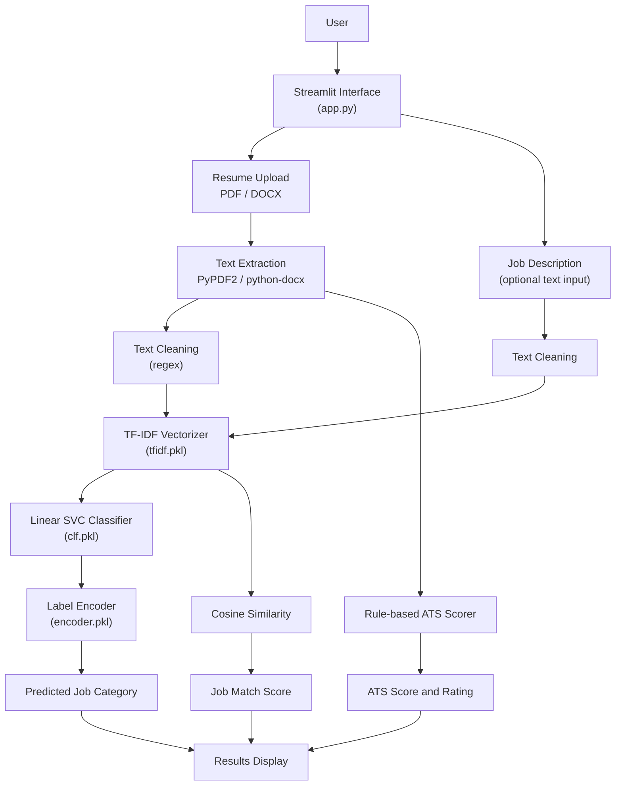
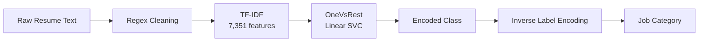

# 📄 AI Resume Screening System

**A Streamlit application that classifies resumes into job categories with a TF-IDF + Linear SVC model, scores them with a rule-based ATS-style checker, and measures resume–job-description similarity.**

[](https://github.com/harshantla-cloud/RESUME-SCREENING-SYSTEM)


This project automates the first pass of resume screening. A user uploads a PDF or DOCX resume and receives a predicted job category, an ATS-style quality score, and — if a job description is pasted in — a similarity-based match score. It is built for candidates who want quick feedback on their resume and for recruiters who need fast, consistent triage of incoming applications.

---

## 🚀 Project Overview

| | |
|---|---|
| **Problem** | Recruiters receive large volumes of unstructured resumes; manually sorting them by role and checking basic resume quality is slow and inconsistent. |
| **Proposed Solution** | A text-classification model (TF-IDF features + Linear SVC) predicts the job category of a resume. A rule-based scorer evaluates resume completeness, and cosine similarity compares a resume against a job description. |
| **Target Users** | Job seekers checking their resume, and recruiters or HR teams performing initial screening. |
| **Real-world Use Case** | Upload a resume, optionally paste a job description, and get a category, an ATS-style score, and a match rating in a single click. |
| **Key Value** | Turns unstructured resume text into three immediately interpretable signals: *what role it fits*, *how complete it looks*, and *how close it is to a given job description*. |

---

## 🎯 Objectives

- Classify resumes into one of **25 job categories** using a supervised NLP model.
- Extract text from **PDF and DOCX** resumes without manual copy-paste.
- Provide an **ATS-style score (0–100)** with a qualitative rating based on transparent, rule-based checks.
- Quantify **resume–job-description similarity** using TF-IDF vectors and cosine similarity.
- Deliver the full workflow through an interactive web interface.

---

## ✨ Key Features

### Core Features
- Resume upload supporting `.pdf` and `.docx` formats
- Text extraction with an editable "Resume Preview" panel
- Predicted job category for the uploaded resume
- ATS-style score with a rating: *Excellent*, *Good*, *Average*, or *Needs Improvement*
- Optional resume–job-description match score with a *Strong / Moderate / Low* verdict

### ML/AI Features
- TF-IDF vectorization (English stop-words removed; 7,351 features)
- Linear SVC wrapped in a One-vs-Rest classifier, serialized for inference
- Label encoding of 25 job categories, inverted at prediction time
- Cosine similarity between resume and job-description TF-IDF vectors

### User Interface Features
- Wide-layout Streamlit app with a custom background image
- Progress bars and metric cards for ATS score and job match
- Clear error handling when no text can be extracted from a file

### Engineering Features
- Pre-trained artifacts (`tfidf.pkl`, `clf.pkl`, `encoder.pkl`) loaded from a `models/` directory
- Reproducible train/test split (`random_state=42`)
- Training workflow documented in a Jupyter notebook
- Minimal dependency footprint (`requirements.txt`)

---

## 🏗️ System Architecture



| Component | Description |
|---|---|
| **Streamlit Interface** | Single-page UI for file upload, optional job description input, and result display. |
| **Text Extraction** | `PyPDF2` reads PDF pages; `python-docx` reads DOCX paragraphs. |
| **Text Cleaning** | Lower-cases text and removes URLs, e-mail addresses, non-alphabetic characters, and extra whitespace. |
| **TF-IDF Vectorizer** | Pre-fitted vectorizer converts cleaned text into a sparse feature vector. |
| **Linear SVC Classifier** | Predicts the encoded job category from the TF-IDF vector. |
| **Label Encoder** | Maps the predicted class index back to a readable job-category name. |
| **ATS Scorer** | Rule-based function scoring contact details, section headings, skill keywords, and resume length. |
| **Cosine Similarity** | Compares resume and job-description TF-IDF vectors to produce a match percentage. |

---

## 🔄 Project Workflow

```mermaid
flowchart LR
    A["Load Dataset<br/>UpdatedResumeDataSet.csv"] --> B["Class Distribution<br/>Analysis"]
    B --> C["Oversample to<br/>Balance Classes"]
    C --> D["Text Cleaning"]
    D --> E["Label Encoding"]
    E --> F["TF-IDF Vectorization"]
    F --> G["Train / Test Split<br/>80 / 20"]
    G --> H["Train and Compare<br/>KNN, Linear SVC, Random Forest"]
    H --> I["Evaluate<br/>Accuracy, Confusion Matrix,<br/>Classification Report"]
    I --> J["Serialize Artifacts<br/>with Pickle"]
    J --> K["Streamlit Application"]
    K --> L["Category, ATS Score,<br/>Job Match"]
```



---

## 🧠 Machine Learning Pipeline

| Stage | Details |
|---|---|
| **1. Dataset** | `UpdatedResumeDataSet.csv` — 962 resumes, 2 columns (`Category`, `Resume`) |
| **2. Features** | Resume text → TF-IDF vector (7,351 features) |
| **3. Target variable** | `Category` — 25 job categories |
| **4. Preprocessing** | Regex cleaning: URLs, `RT`/`cc` tokens, hashtags, mentions, punctuation, and non-ASCII characters removed; whitespace normalized |
| **5. Encoding** | `LabelEncoder` on the category labels |
| **6. Feature engineering** | `TfidfVectorizer(stop_words='english')` |
| **7. Class balancing** | Random oversampling (with replacement) of every category up to the largest class (84), giving 2,100 rows |
| **8. Train/Test split** | 80/20, `random_state=42` → 1,680 train / 420 test samples |
| **9. Models trained** | K-Nearest Neighbors, Linear SVC, Random Forest (each wrapped in `OneVsRestClassifier`) |
| **10. Evaluation metrics** | Accuracy, confusion matrix, per-class classification report |
| **11. Model serialization** | `pickle` — `tfidf.pkl`, `clf.pkl`, `encoder.pkl` |
| **12. Prediction pipeline** | Clean → TF-IDF transform → Linear SVC predict → inverse label-encode |



---

## 🤖 Models Used

| Model | Purpose | Evaluation Metric | Result |
|---|---|---|---|
| K-Nearest Neighbors (One-vs-Rest) | Baseline comparison | Accuracy (hold-out set) | 1.0000 |
| **Linear SVC (One-vs-Rest)** | **Final model — serialized and used in the app** | Accuracy (hold-out set) | **1.0000** |
| Random Forest (One-vs-Rest) | Comparison | Accuracy (hold-out set) | 1.0000 |

All three models reached the same hold-out accuracy, so the scores alone do not separate them. The notebook does not document the selection rationale; Linear SVC is the model that was saved and deployed in the application. See [Known Limitations](#-known-limitations--next-steps) for how to interpret these scores.

---

## 📊 Exploratory Data Analysis

- **Dimensions:** 962 rows × 2 columns (`Category`, `Resume`)
- **Target classes:** 25 job categories
- **Missing values:** none in either column
- **Class imbalance:** category counts range from 20 (Advocate) to 84 (Java Developer); other large classes include Testing (70) and DevOps Engineer (55)
- **Duplicates:** a duplicate-row check on the CSV finds only **166 unique resumes** among the 962 rows
- **Cleaning checks:** URLs, hashtags, mentions, punctuation, and non-ASCII characters were stripped from the text


*Resume count per job category — Java Developer and Testing dominate, Advocate is the smallest class, which motivated the oversampling step.*

---

## 🖥️ Application Preview

The application has a single page with the following flow:

1. **Input interface** — resume uploader (PDF/DOCX), an optional job-description text area, and an expandable *Resume Preview* of the extracted text.
2. **Analyze Resume** button — runs classification and scoring.
3. **Results** — predicted job category, ATS-style score with rating and progress bar, and (if a job description was provided) a job-match score with a Strong / Moderate / Low verdict.

<!--
Add app screenshots to an images/ folder, then uncomment and adjust the paths:

### Home / Input Interface


### Prediction / Result

-->

---

## 📈 Results

**Model performance (hold-out set, 420 samples)**

| Model | Accuracy |
|---|---|
| K-Nearest Neighbors | 1.0000 |
| Linear SVC *(deployed)* | 1.0000 |
| Random Forest | 1.0000 |

**Qualitative checks.** The notebook runs the final pipeline on four hand-written sample resumes:

| Sample resume | Predicted category |
|---|---|
| Data science profile (Python, SQL, ML, EDA) | Data Science |
| Backend profile (Python, FastAPI, REST APIs, MySQL) | Python Developer |
| Python developer profile (Django, Flask, FastAPI) | Python Developer |
| Mechanical engineer profile (AutoCAD, SolidWorks, CNC) | Mechanical Engineer |

**Interpretation.** The pipeline separates the dataset's categories cleanly and its qualitative predictions look sensible. The perfect hold-out scores should be read as an upper bound rather than expected real-world accuracy — see the limitations below.

**ATS-style score (rule-based, not learned).** Points are awarded as follows, capped at 100:

| Check | Points |
|---|---|
| E-mail address present | 15 |
| Phone number present | 10 |
| Section headings (summary/objective, experience, education, skills, projects, certifications) | 5 each |
| Recognized skill keywords (20-term list) | 2 each, capped at 20 |
| Length ≥ 300 words / ≥ 150 words | 10 / 5 |

Ratings: **Excellent** ≥ 80 · **Good** ≥ 60 · **Average** ≥ 40 · **Needs Improvement** < 40.
Job match verdicts: **Strong** ≥ 75% · **Moderate** ≥ 50% · **Low** < 50%.

---

## 🛠️ Tech Stack

| Category | Technology |
|---|---|
| Language | Python |
| Data Processing | Pandas, NumPy |
| Visualization (notebook) | Matplotlib, Seaborn |
| Machine Learning | Scikit-learn (TF-IDF, Linear SVC, KNN, Random Forest, Label Encoding, cosine similarity) |
| Document Parsing | PyPDF2, python-docx |
| Frontend | Streamlit |
| Model Serialization | Pickle |
| Experimentation | Jupyter Notebook |
| Version Control | Git / GitHub |

---

## 📁 Project Structure

```
RESUME-SCREENING-SYSTEM/
│
├── app.py                       # Streamlit application
├── background.png               # App background image
├── requirements.txt             # Python dependencies
├── .gitignore
│
├── data/
│   └── UpdatedResumeDataSet.csv # Labeled resume dataset (962 rows)
│
├── models/
│   ├── tfidf.pkl                # Fitted TF-IDF vectorizer
│   ├── clf.pkl                  # Trained One-vs-Rest Linear SVC
│   └── encoder.pkl              # Fitted LabelEncoder
│
├── notebooks/
│   └── analysis.ipynb           # EDA, preprocessing, training, evaluation
│
├── images/
│   └── eda_category_distribution.png
│
└── README.md
```

> The notebook reads `UpdatedResumeDataSet.csv` from its working directory and writes the `.pkl` files there, so adjust paths if you re-run it from `notebooks/`.

---

## ⚙️ Installation & Setup

### Clone Repository

```bash
git clone https://github.com/harshantla-cloud/RESUME-SCREENING-SYSTEM.git
cd RESUME-SCREENING-SYSTEM
```

### Create a Virtual Environment (recommended)

```bash
python -m venv venv
# Windows
venv\Scripts\activate
# macOS / Linux
source venv/bin/activate
```

### Install Dependencies

```bash
pip install -r requirements.txt
```

### Run the Application

```bash
streamlit run app.py
```

The app opens in your browser (default: `http://localhost:8501`).

### Optional: Run the Notebook

```bash
pip install jupyter matplotlib seaborn
jupyter notebook notebooks/analysis.ipynb
```

---

## ⚠️ Known Limitations & Next Steps

- **Optimistic evaluation.** Oversampling was applied *before* the train/test split, and the source CSV contains many duplicate rows (166 unique resumes out of 962), so copies of the same resume can land in both train and test sets. The 1.0000 accuracy therefore overstates real-world performance. Removing duplicates and splitting before oversampling would give a more reliable estimate.
- **Preprocessing differences.** The notebook's cleaning function and the app's `clean()` function are not identical (the app lower-cases and also drops digits). Sharing one function would remove any training/inference mismatch.
- **Rule-based ATS score.** The score reflects keyword and section checks, not a trained model or an actual ATS vendor's logic.
- **Similarity-based job match.** Cosine similarity over TF-IDF measures vocabulary overlap, not semantic fit.
- **Text-only parsing.** Scanned/image-only PDFs yield no text and return an error.
- **Unpinned dependencies.** `requirements.txt` has no version pins.
- **No deployment, license, or test suite** is included in the repository.

---

## 👤 Author

**Harsh** — B.Tech in Computer Science & Engineering (2023–2027)
Focus: Data Science · Machine Learning · AI · Deep Learning

[](https://github.com/harshantla-cloud)
