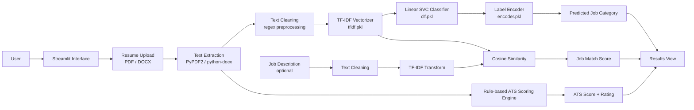
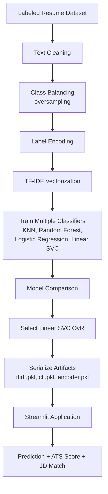
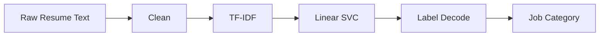

# 📄 AI Resume Screening System

**An NLP-powered web app that classifies resumes into job categories, produces an ATS-style compatibility score, and measures resume-to-job-description similarity in real time.**


This project simulates the first stage of an automated hiring pipeline. A candidate uploads a resume (PDF or DOCX); the system extracts and cleans the text, predicts the most relevant job category with a trained TF-IDF + Linear SVC classifier, scores the resume against common ATS criteria, and optionally compares it with a pasted job description. It is useful for job seekers who want quick feedback on resume quality and for anyone prototyping resume-screening workflows.

---

## 🚀 Project Overview

| | |
|---|---|
| **Problem** | Recruiters and ATS platforms filter large volumes of resumes before a human reads them. Candidates rarely know how their resume is categorized or whether it contains the structure and keywords screening systems look for. |
| **Proposed Solution** | A Streamlit application that combines a trained text classifier (job category), a rule-based ATS scoring engine, and TF-IDF cosine similarity (resume vs. job description). |
| **Target Users** | Job seekers checking resume readiness; developers and students studying applied NLP pipelines. |
| **Real-world Use Case** | Upload a resume, see the predicted role category and an ATS-style score out of 100, then paste a job description to see how closely the resume matches it. |
| **Key Value** | An end-to-end, deployable ML product — from labeled dataset to interactive application — rather than a notebook-only analysis. |

---

## 🎯 Objectives

- Automate extraction of text from PDF and DOCX resumes.
- Predict the most suitable job category from resume content.
- Provide an interpretable, rule-based ATS-style score with a rating band.
- Enable resume-to-job-description comparison using TF-IDF cosine similarity.
- Package the trained artifacts (vectorizer, classifier, label encoder) for fast inference inside a web app.

---

## ✨ Key Features

### Core Features
- PDF and DOCX resume upload
- Live preview of the extracted resume text before analysis
- Predicted job category (25 classes)
- ATS-style score (0–100) with rating: Excellent / Good / Average / Needs Improvement
- Optional job description input with a Resume–Job Match percentage and Strong / Moderate / Low verdict

### ML/AI Features
- Regex-based text cleaning (URLs, emails, non-alphabetic characters)
- TF-IDF vectorization of resume text
- Linear SVC (One-vs-Rest) classifier with label-encoded targets
- Cosine similarity between resume and job description TF-IDF vectors

### User Interface Features
- Streamlit wide-layout interface with custom background styling
- Metric cards, progress bars, and colour-coded match verdicts
- Clear error handling when no text can be extracted from an uploaded file

### Engineering Features
- Pre-trained artifacts serialized with `pickle` and loaded from `models/`
- Modular helper functions for cleaning, extraction, and scoring
- Dependencies pinned by name in `requirements.txt`

---

## 🏗️ System Architecture



| Component | Role |
|---|---|
| **Streamlit Interface** | File upload, job description input, and results display |
| **Text Extraction** | `PyPDF2` for PDFs, `python-docx` for DOCX files |
| **Text Cleaning** | Lowercasing; removal of URLs, emails, and non-alphabetic characters; whitespace normalization |
| **TF-IDF Vectorizer** | Converts cleaned text into numeric features (pre-fitted, loaded from `models/tfidf.pkl`) |
| **Linear SVC** | Predicts the job category (`models/clf.pkl`) |
| **Label Encoder** | Maps predicted class index back to the category name (`models/encoder.pkl`) |
| **ATS Scoring Engine** | Rule-based score computed on the raw extracted text |
| **Similarity Module** | Cosine similarity of resume and job description TF-IDF vectors |

---

## 🔄 Project Workflow



---

## 🧠 Machine Learning Pipeline

| Stage | Details |
|---|---|
| **Dataset** | Labeled resume dataset (~960 resumes, 25 job categories) |
| **Features** | Cleaned resume text, vectorized with TF-IDF |
| **Target Variable** | Job category (label-encoded) |
| **Preprocessing** | Removal of URLs, mentions, hashtags, and special characters |
| **Class Balancing** | Oversampling to address category imbalance |
| **Encoding** | Label encoding of job categories |
| **Train/Test Split** | Not specified |
| **Models Compared** | KNN, Random Forest, Logistic Regression, Linear SVC (One-vs-Rest) |
| **Evaluation Metrics** | Not specified |
| **Model Selection** | Linear SVC (One-vs-Rest) selected as the best-performing model |
| **Serialization** | `pickle` — `tfidf.pkl`, `clf.pkl`, `encoder.pkl` |
| **Inference** | Clean → TF-IDF transform → `predict` → `inverse_transform` to category name |



---

## 🤖 Models Used

| Model | Purpose | Evaluation Metric | Result |
|---|---|---|---|
| K-Nearest Neighbors | Baseline comparison | Not specified | Not specified |
| Random Forest | Baseline comparison | Not specified | Not specified |
| Logistic Regression | Baseline comparison | Not specified | Not specified |
| **Linear SVC (One-vs-Rest)** | **Final job-category classifier** | Not specified | **Selected as best-performing model** |
| TF-IDF + Cosine Similarity | Resume–job description matching (non-trained, similarity-based) | Not applicable | Not applicable |

> **Model selection:** Linear SVC (One-vs-Rest) was chosen as the final model after comparing it with KNN, Random Forest, and Logistic Regression. Numeric scores are not documented in the repository README; see `notebooks/` for the evaluation outputs.

---

## 📊 Exploratory Data Analysis

EDA and model training are carried out in the notebook(s) under `notebooks/`.

- **Dataset:** ~960 labeled resumes across 25 job categories (e.g., Java Developer, Testing, DevOps Engineer, Python Developer, Data Science, HR, Mechanical Engineer).
- **Class distribution:** Categories are imbalanced, which is why oversampling is applied during training.
- **Text characteristics:** Resumes contain URLs, emails, hashtags, and special characters that are removed during cleaning.
- **Missing values, outliers, correlations, dimensions:** Not specified.

---

## 🖥️ Application Preview

### Home / Upload Interface

*Resume upload (PDF/DOCX) and optional job description input.*

### Extracted Resume Preview

*Extracted resume text shown to the user before analysis.*

### Prediction & ATS Score

*Predicted job category, ATS-style score out of 100, rating, and progress bar.*

---

## 📈 Results

- **Output 1 – Job category:** one of 25 predefined categories, predicted by Linear SVC.
- **Output 2 – ATS-style score (0–100):** rule-based, with rating bands: **80+ Excellent · 60–79 Good · 40–59 Average · below 40 Needs Improvement**.
- **Output 3 – Job Match Score (%):** TF-IDF cosine similarity, with verdicts: **75%+ Strong · 50–74% Moderate · below 50% Low**.
- **Model performance metrics:** Not specified in the repository.

### ATS Scoring Logic

| Criterion | Points |
|---|---|
| Email address detected | 15 |
| Phone number detected | 10 |
| Standard sections present (summary, objective, experience, education, skills, projects, certifications) | 5 each (up to 35) |
| Technical keywords detected (20-keyword list: Python, SQL, Java, ML, Git, AWS, etc.) | 2 each (capped at 20) |
| Content length: 300+ words / 150–299 words | 10 / 5 |

The score is a transparent heuristic, not a trained model, and does not replicate any specific commercial ATS.

---

## 🛠️ Tech Stack

| Category | Technology |
|---|---|
| Language | Python |
| Data Processing | Pandas, NumPy |
| Machine Learning / NLP | Scikit-learn (TF-IDF, Linear SVC, cosine similarity) |
| Document Parsing | PyPDF2, python-docx |
| Frontend | Streamlit |
| Model Serialization | Pickle |
| Version Control | Git / GitHub |

---

## 📁 Project Structure

```
RESUME-SCREENING-SYSTEM/
│
├── data/                # Dataset
├── models/              # Serialized artifacts: tfidf.pkl, clf.pkl, encoder.pkl
├── notebooks/           # EDA and model training notebook(s)
├── project_images/      # Screenshots used in this README
├── app.py               # Streamlit application
├── background.png       # App background image
├── requirements.txt     # Python dependencies
├── .gitignore
└── README.md
```

| File | Description |
|---|---|
| `app.py` | Text extraction, cleaning, prediction, ATS scoring, JD matching, and UI |
| `models/` | Pre-trained TF-IDF vectorizer, classifier, and label encoder |
| `notebooks/` | Training and analysis workflow |

---

## ⚙️ Installation & Setup

### Clone Repository

```bash
git clone https://github.com/harshantla-cloud/RESUME-SCREENING-SYSTEM.git
cd RESUME-SCREENING-SYSTEM
```

### Create a Virtual Environment (recommended)

```bash
python -m venv venv
# Windows
venv\Scripts\activate
# macOS / Linux
source venv/bin/activate
```

### Install Dependencies

```bash
pip install -r requirements.txt
```

### Run the Application

```bash
streamlit run app.py
```

Open the local URL shown in the terminal, upload a resume (PDF or DOCX), optionally paste a job description, and click **Analyze Resume**.

---

## 🔮 Roadmap

- [ ] Transformer/BERT-based embeddings for higher classification accuracy
- [ ] Actionable resume improvement suggestions (missing sections/keywords)
- [ ] Public deployment (Streamlit Cloud / Hugging Face Spaces)
- [ ] Documented evaluation metrics (accuracy, precision, recall, F1) in the README

---

## 👤 Author

**Harsh** — B.Tech CSE (2023–2027) · Data Science · Machine Learning · AI

[](https://github.com/harshantla-cloud)
[](https://linkedin.com/in/harsh-5694b13ab)
